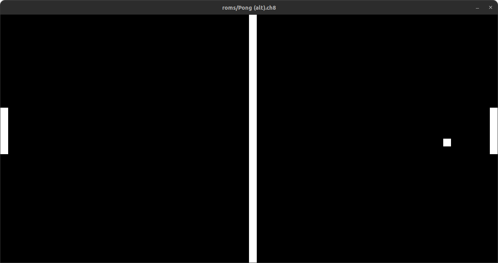

## Usage
### Setting up the application
1. Clone the repository:
   ```bash
   git clone https://github.com/mohame-dev/chip8-emulator.git
   cd chip8-emulator
   ```
2. Install dependencies: <br>
   Ensure you have gcc and SDL2 installed. You can manually install the SDL2 library on your system with the following command:
   - Ubuntu/Debian:
     ```bash
     sudo apt-get install libsdl2-dev
     ```
   - Fedora:
     ```bash
     sudo dnf install SDL2-devel
     ```
   - Mac:
     ```bash
     brew install sdl2
     ```
 3. Building the Project: <br>
    Compile the code with the given Makefile:
    ```bash
    Make
    ```
    Run the emulator with:
    ```bash
    ./chip8 <rom>
    ```
    I have provided a rom which can be used and which works correctly.

### Keypad
The keypad is setup as follows: <br>

<br>
It can be configured in `keyboard.c`: change the `SDLK_<key>` with your preferred key. Do not changed the `0x<key>`.

## Screenshots
Pong being played on the emulator: <br>

